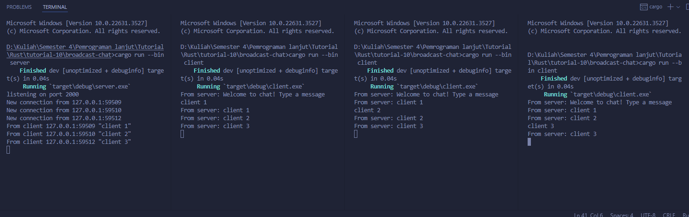

## Nama : Shaquille Athar Adista
## NPM : 2206081875

### 2.1 Original code of broadcast chat.

Saya menjalankan program dengan melakukan `cargo run --bin server` dan `cargo run --bin client`, `cargo run --bin client` saya jalankan di tiga terminal yang berbeda. Pada gambar terlihat bahwa ketika client menuliskan pesan untuk dikirimkan ke server, maka server akan menerima pesan tersebut dan pesan tersebut akan dibagikan ke seluruh client yang terhubung dengan server tersebut.