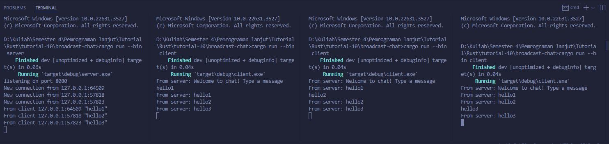
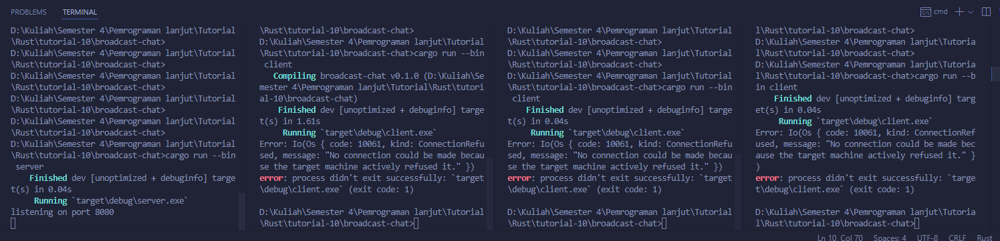
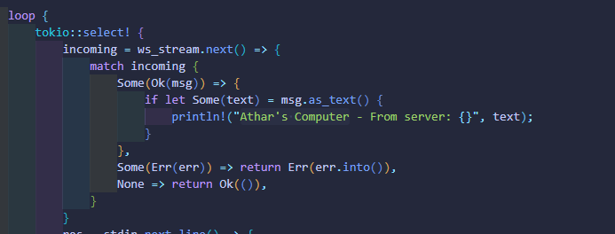
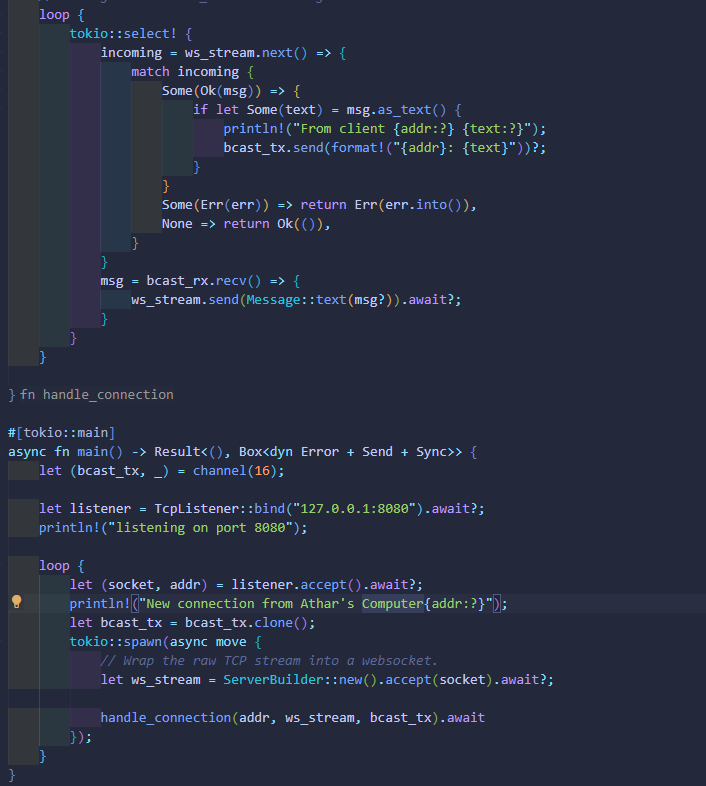
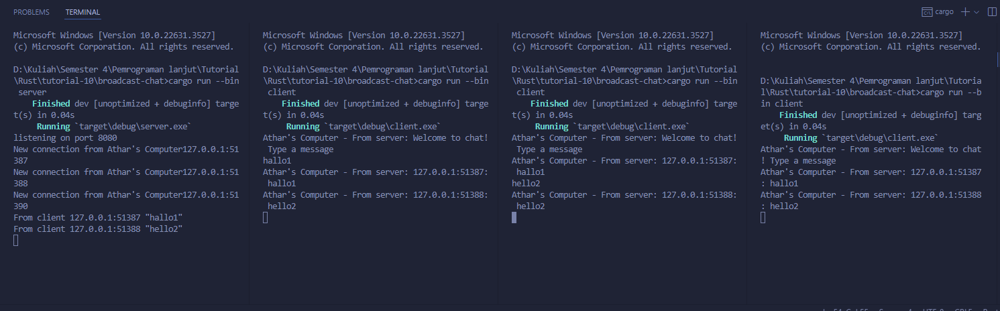

## Nama : Shaquille Athar Adista
## NPM : 2206081875

### 2.1 Original code of broadcast chat.

Saya menjalankan program dengan melakukan `cargo run --bin server` dan `cargo run --bin client`, `cargo run --bin client` saya jalankan di tiga terminal yang berbeda. Pada gambar terlihat bahwa ketika client menuliskan pesan untuk dikirimkan ke server, maka server akan menerima pesan tersebut dan pesan tersebut akan dibagikan ke seluruh client yang terhubung dengan server tersebut.

### 2.2 Modifying the websocket port

port client dan server sama

port client dan server berbeda

Jika port client dan server sama, maka program akan tetap berjalan dengan baik karena client dapat melakukan koneksi dengan server, namun jika port client dan server berbeda, maka akan terjadi error karena client tidak bisa melakukan connect ke port server dikarenakan port yang berbeda sehingga aplikasi akan error.

### 2.3 Small changes. Add some information to client

kode yang diubah di client.rs

kode yang diubah di server.rs

output

Pada kode di server.rs saya mengubah dari `bcast_tx.send(text.into())?;` menjadi `bcast_tx.send(format!("{addr}: {text}"))?;` hal ini agar saya juga mengirimkan data addr (alamat pengiriman) dan bukan data text saja ke client.

Pada kode di client.rs saya menambahkan `Athar's Computer` di println! untuk memberikan tambahan informasi.

